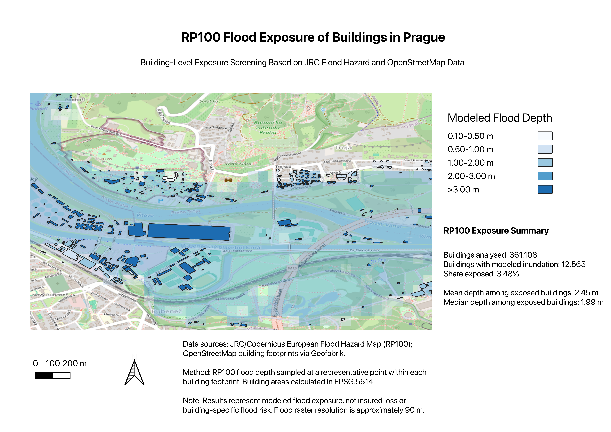

# Prague RP100 Flood Exposure Analysis

A geospatial portfolio project that combines **JRC/Copernicus flood hazard data** with **OpenStreetMap building footprints** to perform building-level flood exposure screening for a defined study area around Prague, Czechia.

The project demonstrates an end-to-end GIS workflow using **QGIS, Python, Rasterio, GeoPandas/Pyogrio, Shapely, and geospatial quality-control techniques**.

> **Important:** The analysis uses a rectangular Prague study area, not the official administrative boundary of Prague.  
> The final map displays a **selected zoomed-in section** of the wider study area, while the summary statistics refer to the **full study area**.

---

## Project Objective

The objective is to build a reproducible geospatial workflow similar to tasks performed in catastrophe-risk and insurance analytics:

1. inspect and validate a large flood-hazard raster;
2. clip the raster to a local study area;
3. extract building footprints from OpenStreetMap data;
4. validate and process building geometries;
5. calculate building footprint areas in a metric CRS;
6. sample RP100 flood depth at a representative point inside each building footprint;
7. classify modeled flood depths;
8. generate building-level exposure statistics and a portfolio-quality map.

The project focuses on **exposure screening**, not insured loss estimation.

---

## Final Map



The map shows a selected zoomed-in section of the wider Prague study area. Building polygons are symbolized by modeled RP100 flood depth.

---

## Key Results

The full study area contains **361,108 building footprints**.

| Metric | Result |
|---|---:|
| Buildings analysed | 361,108 |
| Buildings with modeled inundation | 12,565 |
| Share exposed | 3.48% |
| Mean flood depth among exposed buildings | 2.45 m |
| Median flood depth among exposed buildings | 1.99 m |
| Maximum sampled flood depth | 12.67 m |

### Flood-depth distribution

| RP100 modeled flood depth | Building count | Share of all buildings |
|---|---:|---:|
| 0.10–0.50 m | 1,413 | 0.39% |
| 0.50–1.00 m | 2,201 | 0.61% |
| 1.00–2.00 m | 2,695 | 0.75% |
| 2.00–3.00 m | 2,542 | 0.70% |
| >3.00 m | 3,714 | 1.03% |
| No modeled inundation | 348,543 | 96.52% |

The summary table generated by the workflow is available at:

```text
outputs/tables/rp100_exposure_summary.csv
```

---

## Data Sources

### 1. JRC / Copernicus European Flood Hazard Map

The hazard layer is an **RP100 flood-depth raster** derived from the European flood hazard dataset.

- Scenario: RP100
- Variable: modeled flood depth
- Raster CRS: EPSG:4326
- Approximate spatial resolution: ~90 m
- NoData value: -9999

RP100 represents a flood-hazard level associated with approximately a **1% annual exceedance probability**. It should not be interpreted as a flood that occurs exactly once every 100 years.

### 2. OpenStreetMap / Geofabrik

Building footprints were extracted from a Geofabrik OpenStreetMap GeoPackage covering **Středočeský kraj (with Praha)**.

The building layer used in the analysis is:

```text
gis_osm_buildings_a_free
```

---

## Study Area

The initial study area is a rectangular bounding box around Prague:

```text
West:  14.20
South: 49.90
East:  14.80
North: 50.25
CRS:   EPSG:4326
```

This bounding box was intentionally used for the first portfolio version to create a reproducible raster/vector workflow without claiming that the analysis represents the official Prague administrative boundary.

The final map is a **selected zoomed-in section** within this wider study area.

---

## Methodology

### 1. Raster inspection and quality control

The source European flood raster was inspected for:

- CRS
- raster width and height
- pixel resolution
- spatial bounds
- data type
- NoData values
- minimum and maximum valid flood depths
- valid-pixel percentage

The raster was processed block-by-block to avoid loading the entire multi-billion-pixel dataset into memory.

### 2. Raster clipping

The European RP100 raster was clipped to the Prague study area using Rasterio windowed reading.

The resulting raster size is:

```text
720 × 420 pixels
```

### 3. Building extraction

OpenStreetMap buildings intersecting the study-area bounding box were read directly from the GeoPackage using a spatial bounding-box filter.

A total of:

```text
361,108 buildings
```

were extracted.

### 4. Geometry quality control

The extracted building dataset was checked for:

- missing geometries
- empty geometries
- invalid geometries

Results:

```text
Missing geometries: 0
Empty geometries:   0
Invalid geometries: 0
```

### 5. Building footprint area

Building geometries were reprojected to:

```text
EPSG:5514 — S-JTSK / Krovak East North
```

This allowed footprint area to be calculated in square metres.

Basic area-QC flags were added for unusually small or large footprints.

### 6. Flood-depth sampling

A representative point was generated inside each building footprint.

The longitude and latitude of that point were used to sample the RP100 raster.

For each building, the workflow produces fields such as:

```text
area_m2
area_qc
rp100_depth_raw_m
rp100_depth_m
rp100_inundated
rp100_depth_class
```

### 7. Flood-depth classes

The following classes were used for visualization and summary statistics:

```text
0.10–0.50 m
0.50–1.00 m
1.00–2.00 m
2.00–3.00 m
>3.00 m
```

These are **flood-depth classes**, not insurance-risk classes.

---

## Workflow

```text
JRC European RP100 Flood Raster
            |
            v
Raster QC and metadata inspection
            |
            v
Clip to Prague study area
            |
            +----------------------+
                                   |
                                   v
                      OSM / Geofabrik Buildings
                                   |
                                   v
                         Geometry validation
                                   |
                                   v
                     Reproject to EPSG:5514
                                   |
                                   v
                      Building footprint area
                                   |
                                   v
                 Representative point generation
                                   |
                                   v
                  RP100 flood-depth raster sampling
                                   |
                                   v
                 Building-level exposure dataset
                                   |
                                   v
                  Summary statistics + QGIS map
```

---

## Project Structure

```text
prague-flood-risk-analysis/
│
├── data/
│   ├── raw/
│   │   └── .gitkeep
│   ├── interim/
│   │   └── .gitkeep
│   └── processed/
│       └── .gitkeep
│
├── outputs/
│   ├── figures/
│   ├── maps/
│   │   └── prague_rp100_exposure_map.png
│   └── tables/
│       └── rp100_exposure_summary.csv
│
├── src/
│   ├── inspect_raster.py
│   ├── clip_prague.py
│   ├── inspect_osm.py
│   ├── extract_prague_buildings.py
│   ├── process_buildings.py
│   ├── sample_flood_depth.py
│   └── create_exposure_outputs.py
│
├── .gitignore
├── prague_flood_risk.qgz
└── README.md
```

Large GIS datasets are intentionally excluded from Git using `.gitignore`.

---

## Python Environment

Recommended Python packages:

```bash
pip install rasterio numpy pandas geopandas pyogrio shapely matplotlib
```

A virtual environment can be created with:

```bash
python3 -m venv .venv
source .venv/bin/activate
```

---

## Reproducing the Workflow

Run the scripts from the repository root in the following order:

```bash
python src/inspect_raster.py data/raw/Europe_RP100_filled_depth.tif

python src/clip_prague.py

python src/inspect_osm.py

python src/extract_prague_buildings.py

python src/process_buildings.py

python src/sample_flood_depth.py

python src/create_exposure_outputs.py
```

The final geospatial layers can then be visualized in QGIS using:

```text
prague_flood_risk.qgz
```

---

## Skills Demonstrated

This project demonstrates practical experience with:

- raster GIS
- vector GIS
- QGIS
- Python geospatial workflows
- Rasterio
- GeoPandas
- Pyogrio
- Shapely
- spatial data validation
- coordinate reference systems
- raster window processing
- raster sampling
- OpenStreetMap data
- large geospatial dataset handling
- GIS quality control
- catastrophe-hazard data
- exposure analytics
- cartographic visualization

---

## Limitations

This is a portfolio-scale exposure-screening project and has several important limitations.

### Raster resolution

The flood-hazard raster has an approximate resolution of **90 m**. A single raster cell may therefore cover multiple buildings and does not represent building-specific hydraulic conditions.

### Representative-point sampling

Flood depth is sampled at a single representative point within each building polygon.

A building may partially intersect a flooded raster cell even when its representative point does not.

A future version could use polygon-based raster zonal statistics such as:

- maximum flood depth within each footprint;
- mean flood depth;
- percentage of building footprint inundated.

### Study-area boundary

The analysis uses a rectangular study-area bounding box and does not use the official Prague administrative boundary.

### Exposure vs. risk

The results represent **modeled flood exposure** only.

They do not incorporate:

- building vulnerability;
- construction type;
- insured value;
- insurance policy conditions;
- financial loss;
- event frequency curves;
- uncertainty in the hazard model.

Therefore, the results should not be interpreted as building-specific flood risk or insured loss.

---

## Possible Next Steps

Future extensions could include:

- polygon-based zonal statistics;
- official Prague administrative boundary;
- multiple return periods such as RP10, RP20, RP50, RP200, and RP500;
- flood-depth damage / vulnerability curves;
- synthetic or real exposure values;
- estimated physical damage;
- Average Annual Loss estimation;
- PostGIS integration;
- automated raster QC reporting;
- interactive web mapping;
- comparison of point-sampling and polygon-based methods.

---

## Purpose

This project was developed as a practical geospatial portfolio project focused on **catastrophe-model data preparation, flood-hazard processing, exposure analytics, and GIS quality control**.

It is intended to demonstrate workflows relevant to GIS and catastrophe-risk analytics roles.
